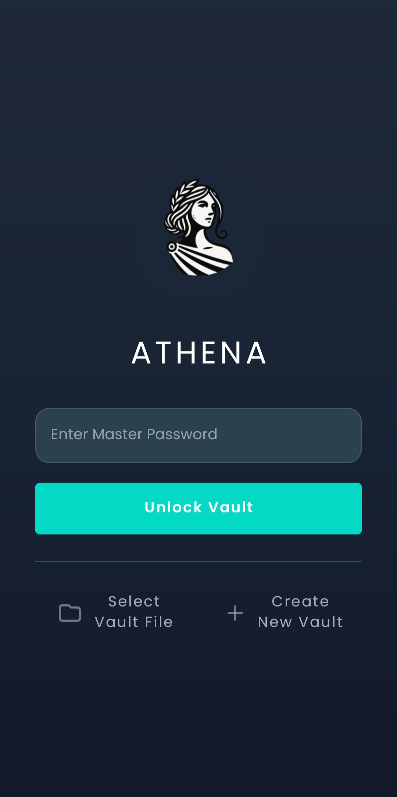
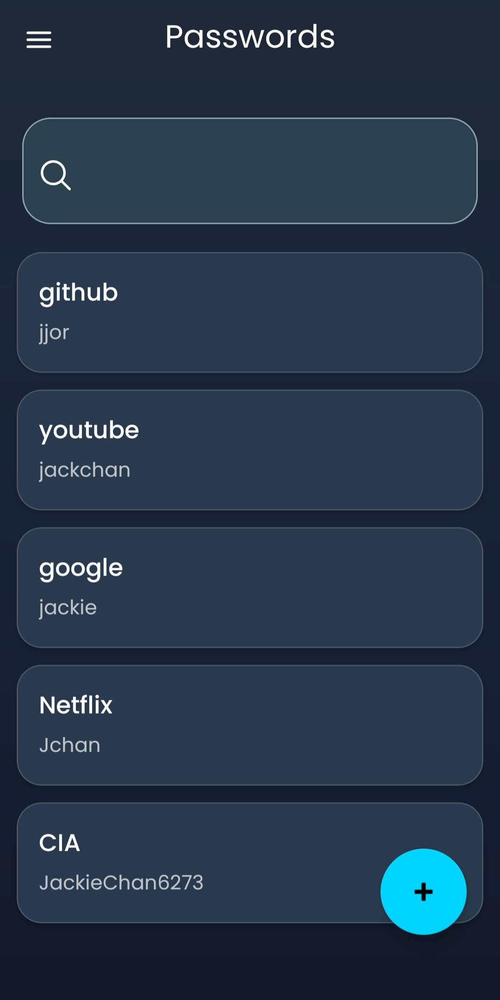
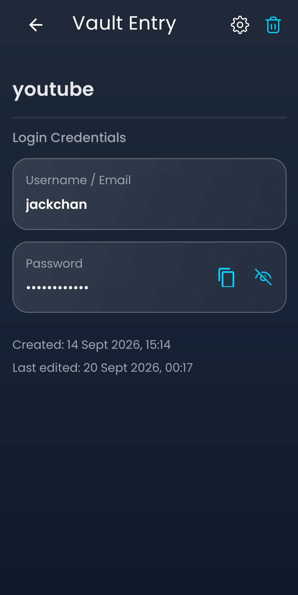
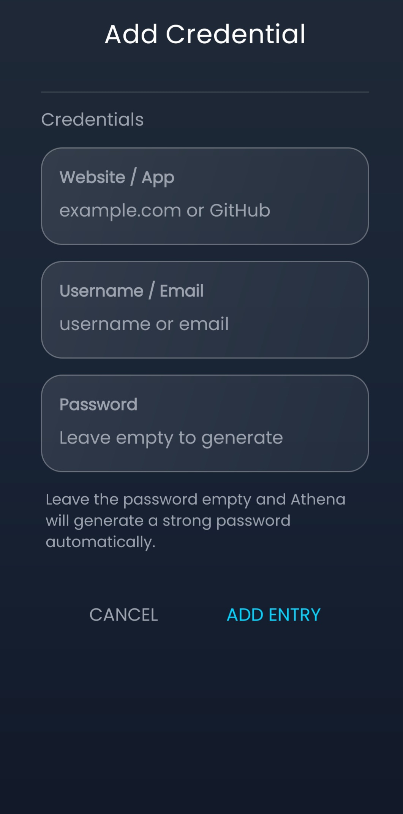
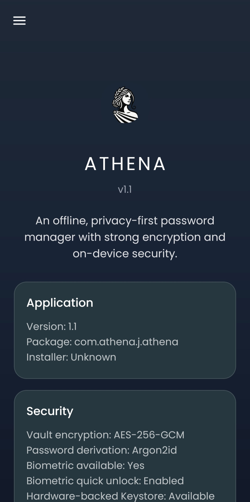
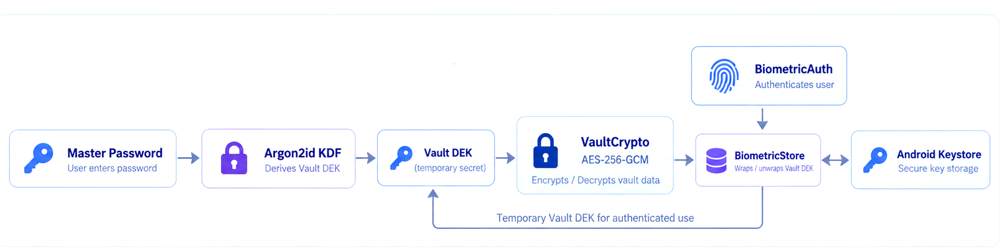

<p align="center">
  
</p>

<h1 align="center">Athena</h1>

<p align="center">
  <b>Offline, privacy-first password management with strong encryption and on-device security.</b>
</p>

<p align="center">
  Athena is a local-first Android password vault designed around strong on-device security, clean UX, and zero cloud dependency.
</p>

<p align="center">
  
  
  
  
  
  
  
</p>

---

## Overview

Athena is an **offline, privacy-first password manager for Android**.

It stores credentials in an encrypted local vault and keeps sensitive operations on-device.

The project was built around a simple principle:

> **Keep password management local, secure, and understandable.**

Athena does not require:

- a cloud backend
- online account creation
- analytics
- remote synchronization
- continuous internet access

The vault is protected with modern cryptography and optional biometric quick unlock using Android Keystore.

---

## Demo

### App Preview

<p align="center">
  
</p>

---

## Screenshots

<p align="center">
  
  
  
</p>

<p align="center">
  
  
</p>

---

## Key Features

- **Offline-first architecture**
  - no account creation
  - no remote backend requirement
  - no cloud synchronization dependency

- **Encrypted local vault**
  - vault content protected using **AES-256-GCM**
  - authenticated encryption provides confidentiality and integrity
  - tampered vault data is rejected

- **Strong password-based key derivation**
  - master password processed using **Argon2id**
  - configurable resource-intensive derivation settings
  - defensive bounds applied to stored Argon2 parameters

- **Separate KEK and DEK design**
  - master password derives a Key Encryption Key
  - vault data uses an independent random Data Encryption Key
  - the DEK is wrapped using the password-derived KEK

- **Biometric quick unlock**
  - optional biometric authentication
  - DEK wrapping using Android Keystore
  - biometric enrollment changes invalidate the Keystore key
  - StrongBox requested when supported by the device

- **Sensitive action protection**
  - re-authentication required for:
    - revealing passwords
    - copying passwords
    - editing credentials
    - deleting credentials

- **Secure clipboard handling**
  - copied passwords are automatically cleared
  - newer clipboard operations cancel older pending clear timers

- **Secure password generation**
  - cryptographically secure randomness
  - lowercase, uppercase, digit, and symbol requirements
  - SecureRandom-based shuffling

- **Session protection**
  - runtime-only DEK storage
  - automatic timeout locking
  - sensitive UI cleanup
  - in-memory key wiping

- **Secure input handling**
  - immediate password masking
  - restricted selection and context actions
  - autofill disabled for protected password inputs

- **Security transparency**
  - signing certificate verification
  - APK digest display
  - release/debuggable state detection
  - debugger detection
  - basic hooking framework indicators

---

## Cryptographic Workflow

<p align="center">
  
</p>

Athena separates password-derived key material from the key that directly encrypts vault contents.

### 1. Master Password → KEK

The user enters a master password.

Athena processes the password using **Argon2id** to derive a 256-bit **Key Encryption Key (KEK)**.

The KEK is used to protect the vault encryption key rather than directly encrypting all vault data.

### 2. Random Vault DEK

Athena generates an independent random 256-bit **Data Encryption Key (DEK)**.

The DEK is the key that actually encrypts and decrypts vault contents.

### 3. DEK Wrapping

The password-derived KEK wraps the DEK using authenticated encryption.

This means:

- changing how the master password is processed does not require redesigning vault data encryption
- the master password is not directly used as the vault encryption key
- the DEK remains independently random

### 4. Vault Encryption

Vault contents are encrypted using:

**AES-256-GCM**

AES-GCM provides:

- confidentiality
- authentication
- integrity
- tamper detection

The encrypted vault is stored as a local JSON-based vault envelope.

### 5. Biometric Quick Unlock

When biometric quick unlock is enabled:

- Athena creates a biometric-protected AES key inside **Android Keystore**
- the Keystore key wraps the vault DEK
- biometric authentication is required to unwrap it
- the Keystore key itself does not leave Android Keystore

StrongBox-backed storage is requested when the device supports it.

### 6. Runtime Key Handling

After authentication, the DEK is held only in the active runtime session.

Athena uses defensive copies and wipes sensitive byte arrays when the session ends or the vault is locked.

---

## Security Design

Athena uses multiple layers of protection rather than relying on a single security control.

### Password Protection

The master password is processed using **Argon2id** with:

- memory-hard derivation
- multiple iterations
- parallel processing lanes
- random salt
- bounds checking on stored Argon2 parameters

This helps increase the cost of offline password guessing.

### Authenticated Encryption

Vault encryption uses **AES-256-GCM** with unique nonces and authentication tags.

Modified or corrupted vault ciphertext is rejected rather than silently decrypted.

### Biometric Protection

Biometric quick unlock is implemented using:

- AndroidX Biometric
- Android Keystore
- AES-GCM key wrapping
- per-operation biometric authentication
- enrollment invalidation

### Sensitive Action Re-authentication

Entering the vault does not automatically authorize every sensitive operation.

Actions including password reveal, copy, edit, and deletion require additional authentication using biometrics or the master password fallback.

### Session Isolation

The vault DEK is kept in memory only during an active session.

Persistent preferences store configuration and metadata, not the plaintext DEK.

---

## Security Notes

Athena is designed to reduce exposure of sensitive data through:

- secure local encryption
- automatic clipboard clearing
- session timeout locking
- runtime key wiping
- screen capture protection in release builds
- restricted secure text input
- authenticated vault writes
- rollback behavior during failed saves
- no analytics
- no cloud transmission in normal operation

No password manager can guarantee absolute security.

Security still depends on factors including:

- device integrity
- Android OS security
- malware exposure
- user password strength
- update hygiene
- physical device access

Athena's tamper and hooking checks should be treated as **defense-in-depth indicators**, not remote attestation or proof that a device is uncompromised.

---

## Testing

Athena includes an extensive Android test suite covering core vault, session, UI, biometric, and security behavior.

### Covered Areas

- vault creation
- correct password unlock
- wrong password rejection
- encrypted save and load
- tamper detection
- authenticated overwrite protection
- rollback behavior
- session storage
- runtime key management
- vault URI handling
- biometric storage behavior
- clipboard clearing
- password generation
- secure input handling
- password masking
- timeout behavior
- vault locking
- entry detail authentication
- credential editing
- credential creation
- vault list behavior
- search behavior
- adapter index preservation
- main activity behavior

### Result

All implemented automated tests passed before publication.

The project also received manual release-build smoke testing for core application behavior.

See [`TESTING.md`](TESTING.md) for the full testing breakdown.

---

## Tech Stack

- **Language:** Kotlin
- **Platform:** Android
- **UI:** Android Views + Material Components
- **Cryptography:** AES-256-GCM
- **Password KDF:** Argon2id
- **Biometrics:** AndroidX Biometric
- **Secure key storage:** Android Keystore
- **Storage:** encrypted local vault file
- **Testing:** JUnit + Android instrumented testing
- **Build system:** Gradle Kotlin DSL

---

## Project Structure

```text
app/src/main/java/com/athena/j/athena/
├── AboutActivity.kt
├── AddEntryActivity.kt
├── BaseSecureActivity.kt
├── BiometricAuth.kt
├── BiometricStore.kt
├── ClipboardUtils.kt
├── EditEntryActivity.kt
├── EntryDetailActivity.kt
├── InstantPasswordTransformationMethod.kt
├── MainActivity.kt
├── PasswordGenerator.kt
├── SecureEditText.kt
├── SplashActivity.kt
├── TamperChecker.kt
├── TimeoutManager.kt
├── VaultActivity.kt
├── VaultAdapter.kt
├── VaultCrypto.kt
├── VaultLocker.kt
├── VaultManager.kt
├── VaultRuntimeSession.kt
└── VaultSessionManager.kt
