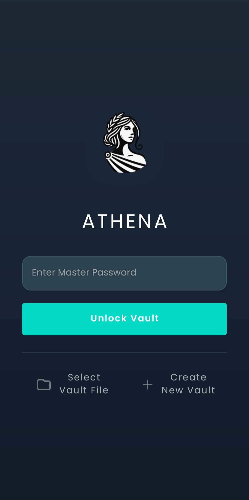
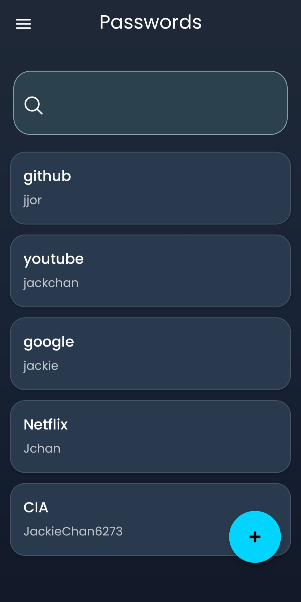
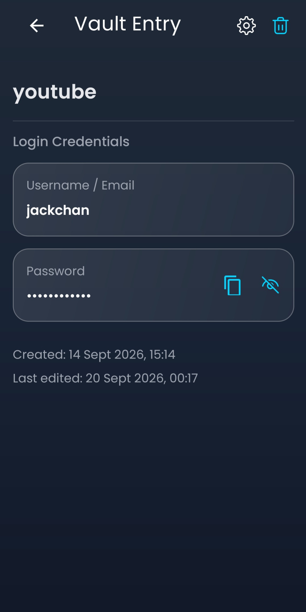
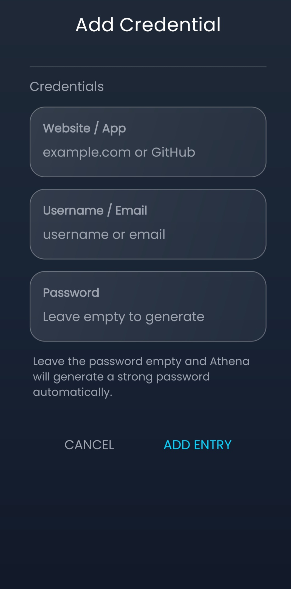
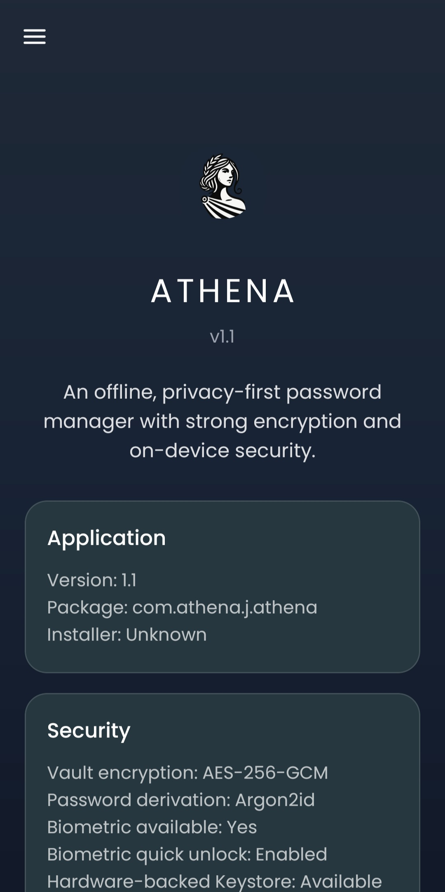
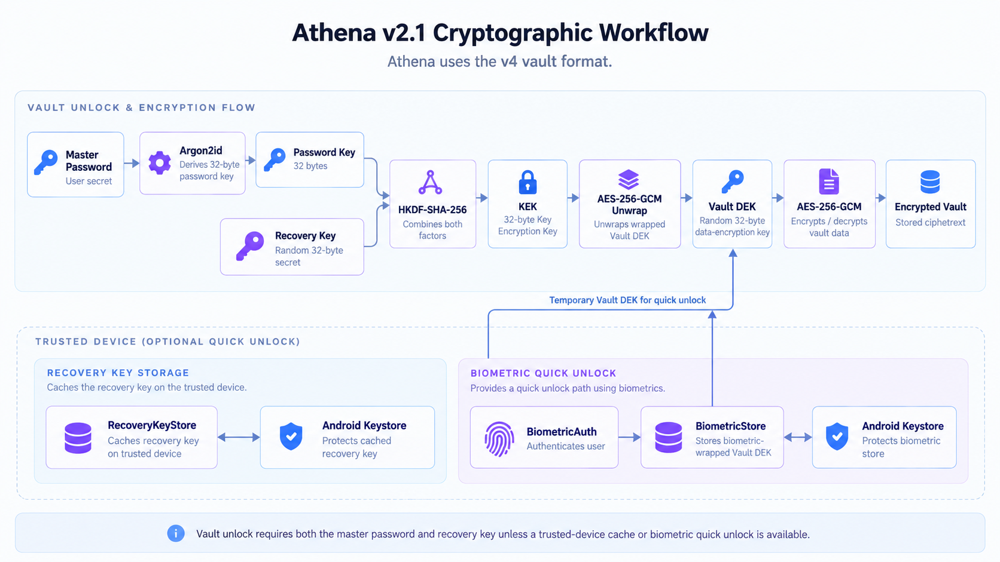

<p align="center">
  
</p>

<h1 align="center">Athena</h1>

<p align="center">
  <b>Offline, privacy-first password management with strong encryption and on-device security.</b>
</p>

<p align="center">
  Athena is a local-first Android password vault designed around strong on-device security, clean UX, and zero cloud dependency.
</p>

<p align="center">
  
  
  
  
  
  
  
  
</p>

---

## Overview

Athena is an **offline, privacy-first password manager for Android**.

It stores credentials in an encrypted local vault and keeps sensitive operations on-device.

The project was built around a simple principle:

> **Keep password management local, secure, and understandable.**

Athena does not require:

- a cloud backend
- online account creation
- analytics
- remote synchronization
- continuous internet access

The vault is protected using modern authenticated encryption, a master password, an independent recovery key, Android Keystore, and optional biometric quick unlock.

---

## Download

The latest signed Android release is available through GitHub Releases.

**Current release: v2.1**

> **Important:** Athena v2.1 uses the **v4 vault format only**. Vaults created using the older v3 format are not compatible with Athena v2.1.
>
> If you still depend on a v3 vault, keep a compatible older Athena release available until you have recreated your vault using the v4 format.

<p align="center">
  <a href="https://github.com/Cheats121/Athena/releases/latest/download/athena_release.apk">
    
  </a>
</p>

<p align="center">
  <a href="https://github.com/Cheats121/Athena/releases/latest">
    View latest release notes and verification information
  </a>
</p>

> The APK is signed using Athena's release signing key.  
> SHA-256 checksums are published with each GitHub release.  
> Athena v2.1 APK SHA-256:  
> `E23E23039D09EFDFDCEAA0861EA3765D2AB9C709854F6DE847AA4C0F1EC8270D`

Because Athena is distributed outside Google Play, Android may ask you to allow installation from your browser or file manager.

---

## Demo

### App Preview

<p align="center">
  
</p>

---

## Screenshots

<p align="center">
  
  
  
</p>

<p align="center">
  
  
</p>

---

## Key Features

- **Offline-first architecture**
  - no account creation
  - no remote backend requirement
  - no cloud synchronization dependency

- **Encrypted local vault**
  - vault contents protected using **AES-256-GCM**
  - authenticated encryption provides confidentiality and integrity
  - tampered or corrupted vault data is rejected

- **Master password protection**
  - master passwords are processed using **Argon2id**
  - memory-hard key derivation
  - random KDF salt
  - defensive bounds applied to stored Argon2 parameters

- **Independent recovery key**
  - a cryptographically random **256-bit recovery key** is generated during vault creation
  - the recovery key is not stored inside the vault file
  - users must save the recovery key separately
  - reinstalling Athena or opening the vault on another device requires the recovery key again

- **Two-factor vault key derivation**
  - Argon2id derives a 256-bit password key from the master password
  - the password key is combined with the recovery key using **HKDF-SHA-256**
  - the resulting Key Encryption Key protects the vault DEK

- **Separate KEK and DEK design**
  - vault contents use an independent random 256-bit Data Encryption Key
  - the DEK is wrapped using **AES-256-GCM**
  - authentication material is separated from the key directly encrypting vault contents

- **Trusted-device recovery-key cache**
  - after successful recovery authentication, the recovery key can be cached locally
  - the cached recovery key is encrypted using Android Keystore
  - normal unlocks on the trusted device can use the master password without requiring the recovery key every time

- **Biometric quick unlock**
  - optional biometric authentication
  - verified DEK wrapping using Android Keystore
  - per-operation biometric authorization
  - biometric enrollment changes invalidate the biometric Keystore key
  - StrongBox is requested when supported by the device

- **Strong master-password creation**
  - 14–128 characters
  - at least one uppercase letter
  - at least one lowercase letter
  - at least one digit
  - at least one symbol
  - zxcvbn-based password-strength feedback

- **Sensitive action protection**
  - re-authentication required for:
    - revealing passwords
    - copying passwords
    - editing credentials
    - deleting credentials

- **Secure clipboard handling**
  - copied passwords are automatically cleared
  - newer copy operations cancel older pending clear timers

- **Secure password generation**
  - cryptographically secure randomness
  - lowercase, uppercase, digit, and symbol requirements
  - SecureRandom-based shuffling

- **Session protection**
  - runtime-only DEK storage
  - automatic timeout locking
  - sensitive UI cleanup
  - in-memory key wiping

- **Secure input handling**
  - immediate password masking where appropriate
  - restricted selection and context actions
  - autofill disabled for protected password inputs

- **Security transparency**
  - signing certificate verification
  - installed APK SHA-256 display
  - release/debuggable state detection
  - debugger detection
  - basic hooking framework indicators

---

## Cryptographic Workflow

Athena v2.1 uses the **v4 vault format**.

<p align="center">
  
</p>

### 1. Master Password → Password Key

The user enters a master password.

Athena processes the password using **Argon2id** to derive a 256-bit password key.

The vault stores the required Argon2id parameters and random salt.

Stored KDF parameters are checked against defensive bounds before use.

### 2. Independent Recovery Key

When a new vault is created, Athena generates a cryptographically random **256-bit recovery key**.

The recovery key:

- is displayed during vault creation
- must be saved separately by the user
- is not stored inside the encrypted vault file
- is required when opening the vault after reinstalling Athena
- is required when opening the vault on a new device
- is required if the trusted-device recovery-key cache is unavailable

Loss of both the trusted-device cache and the saved recovery key makes the vault unrecoverable, even if the master password is still known.

### 3. Password Key + Recovery Key → KEK

Athena combines:

```text
passwordKey || recoveryKey
```

using **HKDF-SHA-256**.

The HKDF derivation uses the vault identifier as salt and a fixed Athena v4 context string.

The result is a 256-bit **Key Encryption Key (KEK)**.

The KEK is used to unwrap the vault's Data Encryption Key.

This means possession of the encrypted vault file alone is insufficient to efficiently verify master-password guesses without also possessing the independently generated recovery key.

### 4. Random Vault DEK

Athena generates an independent random 256-bit **Data Encryption Key (DEK)**.

The DEK directly encrypts and decrypts the vault contents.

The DEK is not derived directly from the master password.

### 5. DEK Wrapping

The derived KEK wraps the random DEK using:

**AES-256-GCM**

Authenticated metadata is included as AES-GCM additional authenticated data so changes to security-critical vault metadata cause authentication failure.

### 6. Vault Encryption

Vault contents are encrypted using:

**AES-256-GCM**

AES-GCM provides:

- confidentiality
- authentication
- integrity
- tamper detection

The encrypted credential data is stored inside the local v4 JSON vault envelope.

### 7. Trusted-Device Recovery-Key Cache

After the recovery key has been successfully entered and verified, Athena can cache it locally for future unlocks on that device.

The recovery key is encrypted using an AES-256-GCM key stored inside **Android Keystore**.

The cached recovery key is bound to the vault identifier.

This allows normal unlocks on the trusted device to require only the master password while keeping the recovery key independent from the vault file.

If Athena is uninstalled, application data is cleared, or the Keystore entry becomes unavailable, the recovery key must be entered again.

### 8. Biometric Quick Unlock

When biometric quick unlock is enabled:

- Athena creates a biometric-protected AES key inside **Android Keystore**
- the Keystore key wraps the verified vault DEK
- biometric authentication is required to unwrap the DEK
- the Keystore key itself does not leave Android Keystore

Biometric quick unlock operates independently from the normal master-password and recovery-key derivation flow once a verified DEK has been enrolled.

StrongBox-backed key storage is requested when the device supports it.

### 9. Runtime Key Handling

After successful authentication, the DEK is held only in the active runtime session.

Athena uses defensive copies of sensitive key material and wipes sensitive byte arrays when the session ends or the vault is locked.

---

## Security Design

Athena uses multiple layers of protection rather than relying on a single security control.

### Password and Recovery-Key Protection

The master password is processed using **Argon2id** with:

- memory-hard derivation
- multiple iterations
- parallel processing lanes
- random salt
- defensive bounds on stored Argon2 parameters

The resulting password key is combined with the independent random recovery key using **HKDF-SHA-256**.

The resulting KEK unwraps the random vault DEK.

The recovery key is not stored inside the vault file.

This separates knowledge of the master password from possession of the independently generated recovery secret.

### Authenticated Encryption

Vault encryption and DEK wrapping use **AES-256-GCM** with unique nonces and authentication tags.

Modified or corrupted ciphertext is rejected rather than silently decrypted.

Security-sensitive vault metadata is authenticated as part of the cryptographic envelope.

### Recovery-Key Protection

The recovery key exists independently from the encrypted vault.

When cached on a trusted device, it is encrypted using a key managed by **Android Keystore**.

The cached recovery key is used only to restore the second component required for normal KEK derivation.

A user should maintain a separate offline copy of the recovery key.

### Biometric Protection

Biometric quick unlock is implemented using:

- AndroidX Biometric
- Android Keystore
- AES-GCM key wrapping
- per-operation biometric authentication
- biometric enrollment invalidation

Biometric authentication unwraps the verified vault DEK directly.

### Sensitive Action Re-authentication

Entering the vault does not automatically authorize every sensitive operation.

Actions including password reveal, copy, edit, and deletion require additional authentication using biometrics or the master-password authentication path.

### Session Isolation

The vault DEK is kept in memory only during an active session.

Persistent preferences store configuration and metadata rather than the plaintext DEK.

Runtime key material is cleared when Athena locks the vault.

---

## Security Notes

Athena is designed to reduce exposure of sensitive data through:

- secure local encryption
- Argon2id password derivation
- independent recovery-key protection
- HKDF-SHA-256 key combination
- AES-256-GCM authenticated encryption
- Android Keystore protection
- automatic clipboard clearing
- session timeout locking
- runtime key wiping
- screen capture protection in release builds
- restricted secure text input
- authenticated vault writes
- rollback behavior during failed saves
- no analytics
- no cloud transmission in normal operation

No password manager can guarantee absolute security.

Security still depends on factors including:

- device integrity
- Android OS security
- malware exposure
- master-password strength
- recovery-key storage practices
- update hygiene
- physical device access

Athena's tamper and hooking checks should be treated as **defense-in-depth indicators**, not remote attestation or proof that a device is uncompromised.

The trusted-device recovery-key cache also means compromise of the local application environment, Android Keystore, or the unlocked device can change the threat model compared with possession of the encrypted vault file alone.

---

## Testing

Athena includes an extensive Android test suite covering core vault, session, UI, biometric, recovery, and security behavior.

### Covered Areas

Athena's automated tests cover the core security and application workflows, including vault creation and unlocking, recovery-key handling, encryption and tamper detection, biometric authentication, session and timeout behavior, clipboard protection, secure input handling, password generation and strength checks, credential management, vault navigation, and main application behavior.

### Result

**244 / 244 automated tests passed before publication.**

The project also received manual release-build testing covering:

- vault creation
- recovery-key display
- biometric quick unlock
- application reinstall
- existing vault selection
- master-password authentication
- recovery-key authentication
- trusted-device recovery-key caching
- password-only unlock after recovery
- corrupted vault rejection
- release-signing certificate verification

See [`TESTING.md`](TESTING.md) for the full testing breakdown.

---

## Tech Stack

- **Language:** Kotlin
- **Platform:** Android
- **UI:** Android Views + Material Components
- **Cryptography:** AES-256-GCM
- **Password KDF:** Argon2id
- **Key combination:** HKDF-SHA-256
- **Biometrics:** AndroidX Biometric
- **Secure key storage:** Android Keystore
- **Storage:** encrypted local vault file
- **Password strength:** zxcvbn
- **Testing:** JUnit + Android instrumented testing
- **Build system:** Gradle Kotlin DSL

---

## Roadmap

Athena currently focuses on secure local credential management on Android.

Future development is planned around expanding portability and usability without abandoning Athena's local-first security model.

### Encrypted Vault Backups

Planned backup functionality will focus on preserving the encrypted vault rather than exporting credentials as plaintext.

### Seamless Credential Filling on PC

A longer-term goal is to provide secure credential filling for desktop applications and websites.

The intended direction includes:

- authenticated credential retrieval
- reduced reliance on manual copy and paste
- explicit user authorization before filling sensitive credentials

### Accessibility and UX

Future improvements may also include:

- expanded accessibility support
- smoother navigation
- additional vault organization tools

---

## Vault Format

Athena v2.1 uses its **v4 encrypted vault format**.

At a high level, a v4 vault contains:

- vault format metadata
- vault format version
- Argon2id parameters
- random KDF salt
- random vault identifier
- HKDF combiner metadata
- AES-256-GCM wrapped DEK
- AES-256-GCM encrypted vault payload
- nonces
- authentication tags

A simplified envelope resembles:

```json
{
  "format": "athena-vault",
  "version": 4,
  "vaultId": "...",
  "kdf": {
    "name": "argon2id",
    "combiner": "hkdf-sha256",
    "info": "ATHENA|V4|VAULT-KEK",
    "memoryKiB": 65536,
    "iterations": 3,
    "parallelism": 4,
    "salt": "..."
  },
  "wrappedDek": {
    "cipher": "aes-256-gcm",
    "nonce": "...",
    "ciphertext": "..."
  },
  "vault": {
    "cipher": "aes-256-gcm",
    "nonce": "...",
    "ciphertext": "..."
  }
}
```

The recovery key is **not stored inside the vault file**.

Plaintext credentials are never stored directly in the vault file.

### Vault Compatibility

Athena v2.1 is intentionally **v4-only**.

It does not contain v3 vault compatibility or automatic v3-to-v4 migration logic.

Older v3 vaults should be handled using a compatible older Athena release and recreated in the v4 format before relying solely on Athena v2.1.

---
## Privacy

Athena is designed to operate locally.

The application does not require:

- cloud accounts
- remote credential storage
- analytics services
- cloud synchronization
- a backend server

The user's encrypted vault remains under the user's control.

Recovery keys are generated locally and should be stored separately by the user.

Athena does not require an Internet connection for normal vault operation.

---

## Release Verification

Athena release APKs are signed using the project's release signing certificate.

For Athena v2.1:

```text
APK SHA-256
E23E23039D09EFDFDCEAA0861EA3765D2AB9C709854F6DE847AA4C0F1EC8270D
```

Signing certificate SHA-256:

```text
6F:92:6C:79:8F:D2:2D:44:94:8C:1B:44:02:ED:D3:A8:BD:CE:0F:46:FA:C0:F0:5D:D8:CB:99:53:00:C3:2E:64
```

Users can independently calculate an APK SHA-256 hash and compare it with the value published in the GitHub release.

On Windows PowerShell:

```powershell
Get-FileHash .\athena_release.apk -Algorithm SHA256
```

The APK signing certificate can also be inspected using Android SDK `apksigner`:

```powershell
apksigner verify --print-certs .\athena_release.apk
```

---

## ⚠️ Disclaimer

Athena is a personal and educational security-focused software project.

It has **not undergone an independent professional security audit**.

Users should review the source code, threat model, build process, and operational security assumptions before trusting Athena with real-world sensitive credentials.

---
